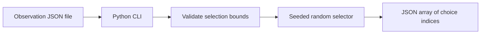

# TCG CABT Lab

[](https://github.com/Builder106/tcg-cabt-lab/actions/workflows/ci.yml)
[](https://www.python.org/downloads/)
[](#license)

TCG CABT Lab is a research project about compact agents for the 60-card Pokemon Trading Card Game. The first planned study asks whether training against varied opponents improves performance on deck families the agent has never trained on.

## Project status

The scaffold includes a seeded random-choice selector, a Python CLI, tests, locked development tools, and CI. The selector follows the random sampling pattern in the [CABT documentation](https://matsuoinstitute.github.io/cabt/). Simulator integration, training, tournament evaluation, and the public demo are upcoming work. There are no measured gameplay results yet.

Read the [research plan](RESEARCH.md), [roadmap](ROADMAP.md), and [showcase brief](docs/showcase.md).

## Try the scaffold

Use Python 3.12 and uv 0.12.5:

```sh
uv sync --frozen --group dev
uv run tcg-cabt-lab sample examples/selection.json --seed 11
```

The example is a synthetic choice request with three empty option records. The command prints a JSON array containing two distinct indices. It checks selection counts and input shape without launching CABT or evaluating card effects. Initial deck selection is unsupported. This is a local smoke test, not a Kaggle submission entrypoint.

The sampler can also be imported with a caller-owned random generator:

```python
from random import Random

from tcg_cabt_lab.baseline import choose_random_action

action = choose_random_action(observation, Random(11))
```

Keep the generator alive across decisions when integrating an agent. The CLI creates a fresh generator for each invocation. Full simulator runs must check that actions are accepted by the pinned engine.

## Current flow



## Repository layout

| Path | Contents |
| --- | --- |
| `src/tcg_cabt_lab/` | Random selector and CLI |
| `tests/` | Choice invariants, malformed input, and CLI checks |
| `examples/` | Synthetic choice request for the smoke test |
| `experiments/` | Draft study settings, with unresolved fields marked as null |
| `RESEARCH.md` | Question, controls, evaluation, data policy, and sources |
| `ROADMAP.md` | Milestones and completion criteria |
| `docs/showcase.md` | Public tournament and match-viewer brief |
| `JOURNAL.md` | Decisions behind the project |

Runtime dependencies are empty. Add the simulator and learning stack with their implementation milestones. Datasets, deck CSVs, checkpoints, raw matches, and generated reports stay outside Git. Small synthetic fixtures are tracked explicitly.

## License

Project code is licensed under [MIT](LICENSE). CABT, competition inputs, Pokemon assets, datasets, and model weights retain their own terms. The project license does not grant rights to redistribute those materials.
